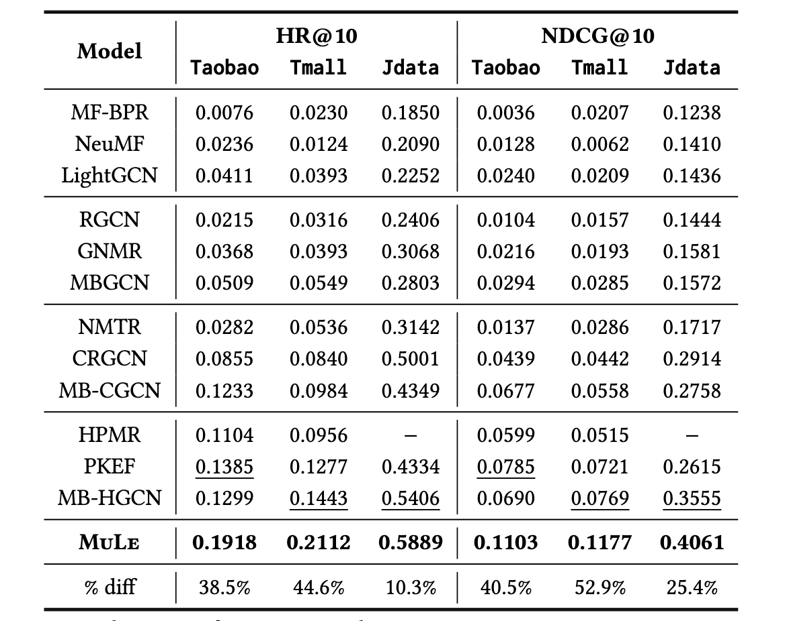

# MULE
This is the official code of **MULE** (Multi-Grained Graph Learning for Multi-Behavior
Recommendation), which is submitted in CIKM 2024.  


## Prerequisties
You can install required packages with a conda environment by typing the following command in your terminal:
```bash
conda create -n MULE python=3.9
conda activate MULE
pip install -r requirements.txt
```


## Datasets
The statistics of datasets used in MuLe is as follows:  
  

We gathered Tmall and Jdata datasets from [CRGCN](https://github.com/MingshiYan/CRGCN) and Taobao dataset from [MBCGCN](https://github.com/SS-00-SS/MBCGCN).
You should preprocess the dataset to utilize in our codes by typing the following command:
```
python ./data/preprocess.py
```

## Usage
### Train the model from scratch
You can train the model with the best hyperparameters for each dataset by typing the following command in your terminal:

#### `Taobao`
```python
python ./src/main.py --dataset taobao\
			 --lr 1e-4\
			 --weight_decay 0\
			 --tda_layers 4\
			 --gnn_layers 1\
			 --emb_dim 64\
			 --num_epochs 100
```

#### `Tmall`
```python
python ./src/main.py --dataset tmall\
			 --lr 5e-4\
			 --weight_decay 1e-5\
			 --tda_layers 5\
			 --gnn_layers 1\
			 --emb_dim 64\
			 --num_epochs 100
```

#### `Jdata`
```python
python ./src/main.py --dataset jdata\
			 --lr 1e-3\
			 --weight_decay 0\
			 --tda_layers 5\
			 --gnn_layers 1\
			 --emb_dim 64\
			 --num_epochs 100
```

### Use a pre-trained model
Because of the volume limit of the anonymous github, we provided the pre-trained  parameters in [google drive](https://drive.google.com/drive/folders/1L5wnVGQ6EhBy9wyPJTOxsU9JD7zIIvrc?usp=sharing). 
You can download the pre-trained files as follows:
```bash
gdown --folder https://drive.google.com/drive/folders/1L5wnVGQ6EhBy9wyPJTOxsU9JD7zIIvrc 
```
After downloading the pre-trained parameters, you can run the pre-trained model by adding `--load_checkpoint` option to the python training command.


## Result of Pre-trained MuLe
The results of the pre-trained models are as follows:
|**Dataset**|**HR@10**|**NDCG@10**|
|:-:|:-:|:-:|
|**Taobao**|0.1939|0.1109|
|**Tmall**|0.2109|0.1165|
|**Jdata**|0.5820|0.4147|

All experiments are conducted on RTX 4090 (24GB) with cuda version 11.8, and the above results were produced with the random seed `seed=42`.

The reported results in the paper are as follows:  


## Detailed Options
You can train and evaluate with custom hyperparmeters as follows:
|**Option**|**Description**|**Default**|
|:-:|:-:|:-:|
|`dataset`|dataset name|taobao|
|`data_dir`|data directory path|./data|
|`checkpoint_dir`|checkpoint directory path|./checkpoint|
|`load_checkpoint`|whether to load the configuration used in a pre-trained model|False|
|`batch_size`| batch size for target data | 1024 |
|`lr`| learning rate | 0.0001|
|`weight-decay`|strength $\lambda$ of L2 regularization|0.00001|
|`gnn_layers`| number of LightGCN layers | 1|
|`tda_layers`| number of TDA layers | 4|
|`emb_dim`|embedding dimension|64|
|`num-epochs`|number of epochs|100|
|`seed`|random seed; If None, the seed is not fixed|42|
|`device`| training device | cuda:0|
|`topk`| Top-k items | 10|
