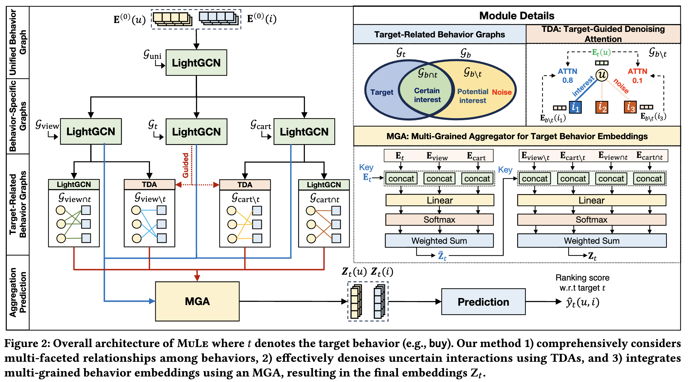
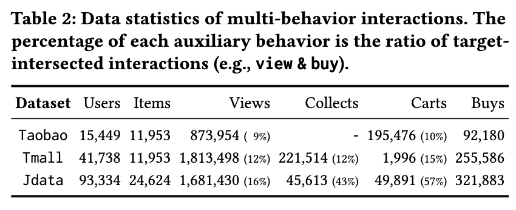

# MuLe
This is the official code for **MuLe** (Multi-Grained Graph Learning for Multi-Behavior Recommendation), accepted to CIKM 2024.



## Prerequisties
You can install the required packages with a conda environment by typing the following command in your terminal:
```bash
conda create -n MULE python=3.9
conda activate MULE
pip install -r requirements.txt
```


## Datasets
The statistics of datasets used in MuLe are summarized as follows. The percentage of each auxiliary behavior is the ratio of target intersected interactions (e.g., view and buy).   
| Dataset | Users  | Items  | Views       | Collects        | Carts         | Buys   |
|---------|--------:|--------:|-------------:|-----------------:|---------------:|--------:|
| Taobao  | 15,449 | 11,953 | 873,954 (9%)| -               | 195,476 (10%) | 92,180 |
| Tmall   | 41,738 | 11,953 | 1,813,498 (12%)| 221,514 (12%)  | 1,996 (15%)   | 255,586|
| Jdata   | 93,334 | 24,624 | 1,681,430 (16%)| 45,613 (43%)   | 49,891 (57%)  | 321,883|

<!---->

We gathered Tmall and Jdata datasets from [CRGCN](https://github.com/MingshiYan/CRGCN) and Taobao dataset from [MBCGCN](https://github.com/SS-00-SS/MBCGCN).
To preprocess the datasets for use in our code, type the following command:
```
python ./data/preprocess.py
```

## Usage
### Train our model from scratch
You can train the model with the best hyperparameters for each dataset by typing the following command in your terminal:

#### Train MuLE in the `Taobao` dataset
```python
python ./src/main.py --dataset taobao \
                     --lr 1e-4 \
                     --weight_decay 0 \
                     --tda_layers 4 \
                     --gnn_layers 1 \
                     --emb_dim 64 \
                     --num_epochs 100 \
                     --batch_size 1024
```

#### Train MuLE in the `Tmall` dataset
```python
python ./src/main.py --dataset tmall \
                     --lr 5e-4 \
                     --weight_decay 1e-5 \
                     --tda_layers 5 \
                     --gnn_layers 1 \
                     --emb_dim 64 \
                     --num_epochs 100 \
                     --batch_size 1024
```

#### Train MuLE in the `Jdata` dataset
```python
python ./src/main.py --dataset jdata \
                     --lr 1e-3 \
                     --weight_decay 0 \
                     --tda_layers 5 \
                     --gnn_layers 1 \
                     --emb_dim 64 \
                     --num_epochs 100 \
                     --batch_size 1024
```

### Use a pre-trained MuLe
Because of the volume limit of the github, we provide the pre-trained parameters of MuLe for each dataset in [google drive](https://drive.google.com/drive/folders/1L5wnVGQ6EhBy9wyPJTOxsU9JD7zIIvrc?usp=sharing). 
You can download the pre-trained files as follows:
```bash
gdown --folder https://drive.google.com/drive/folders/1L5wnVGQ6EhBy9wyPJTOxsU9JD7zIIvrc 
```
After downloading the pre-trained parameters, you can run the pre-trained model by adding `--load_checkpoint` option to the above training command.


## Result of Pre-trained MuLe
The test performance of the pre-trained MuLE for each dataset is as follows:
|**Dataset**|**HR@10**|**NDCG@10**|
|:-:|:-:|:-:|
|**Taobao**|0.1939|0.1109|
|**Tmall**|0.2109|0.1165|
|**Jdata**|0.5820|0.4147|

All experiments are conducted on RTX 4090 (24GB) with cuda version 11.8, and the above results were reproduced with the random seed `seed=42`.

The reported results in the paper are as follows:  
| HR@10   | Taobao           | Tmall     | Jdata     |
|---------|:----------------:|:---------:|:---------:|
| LightGCN| 0.0411           | 0.0393    | 0.2252    |
| CRGCN   | 0.0855           | 0.0840    | 0.5001    |
| MB-CGCN | 0.1233           | 0.0984    | 0.4349    |
| HPMR    | 0.1104           | 0.0956    | -         |
| PKEF    | 0.1385           | 0.1277    | 0.4334    |
| MB-HGCN | 0.1299           | 0.1443    | 0.5406    |
| MuLE    | **0.1918**       | **0.2112**| **0.5889**|
| % diff  | 38.5%            | 44.6%     | 10.3%     |

| NDCG@10 | Taobao          | Tmall     | Jdata     |
|---------|:---------------:|:---------:|:---------:|
| LightGCN| 0.0240          | 0.0209    | 0.1436    |
| CRGCN   | 0.0439          | 0.0442    | 0.2914    |
| MB-CGCN | 0.0677          | 0.0558    | 0.2758    |
| HPMR    | 0.0599          | 0.0515    | -         |
| PKEF    | 0.0785          | 0.0721    | 0.2615    |
| MB-HGCN | 0.0690          | 0.0769    | 0.3555    |
| MuLE    | **0.1103**      | **0.1177**| **0.4061**|
| % diff  | 40.5%           | 52.9%     | 25.4%     |


### Validated hyperparameters of MuLe
We provide the validated hyperparameters of MuLe for each dataset to ensure reproducibility.

|Dataset| $\eta$ | $\lambda$ | $L_{\texttt{tda}}$ | $L_{\texttt{light}}$ | $d$ | $T$ | $B$
|-------|-------|-------|-------|-------|-------|-------|-------|
|Taobao| 1e-4 | 0 | 4 | 1 | 64 | 100 | 1024 |
|Tmall| 5e-4 | 1e-5 | 5 | 1 | 64 | 100 | 1024 |
|Jdata| 1e-3 | 0 | 5 | 1 | 64 | 100 | 1024 |

**Description of each hyperparameter**
* $\eta$: learning rate of the Adam optimizer (`--lr`)
* $\lambda$: weight decay for L2-regularization (`--weight_decay`)
* $L_{\texttt{tda}}$: number of TDA's layers (`--tda_layers`)
* $L_{\texttt{light}}$: number of LightGCN's layers (`--gnn_layers`)
* $d$: embedding dimension (`--emb_dim`)
* $T$: number of epochs (`--num_epochs`)
* $B$: batch size for target data (`--batch_size`)


## Detailed Options
You can train and evaluate your own dataset with custom hyperparameters as follows:
|**Option**|**Description**|**Default**|
|:-:|:-:|:-:|
|`dataset`|dataset name|taobao|
|`data_dir`|data directory path|./data|
|`checkpoint_dir`|checkpoint directory path|./checkpoint|
|`load_checkpoint`|whether to load the configuration used in a pre-trained model|False|
|`batch_size`| batch size for target data | 1024 |
|`lr`| learning rate | 0.0001|
|`weight_decay`|strength $\lambda$ of L2 regularization|0.00001|
|`gnn_layers`| number of LightGCN layers | 1|
|`tda_layers`| number of TDA layers | 4|
|`emb_dim`|embedding dimension|64|
|`num_epochs`|number of epochs|100|
|`seed`|random seed; If None, the seed is not fixed|42|
|`device`| training device | cuda:0|
|`topk`| Top-k items | 10|

